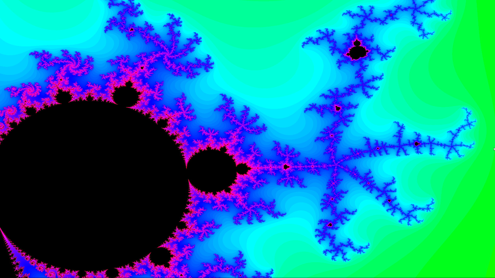

# Mandelbrot Viewer

<sup>Zoomed in a little</sup>

A simple, multithreaded Mandelbrot set viewer with zoom functionality and improved contrast through a logarithmic scale.

---

## Features
#### Multithreaded processing
- the program automatically allocates a number of threads based on your systems capabilities to decrease render times
#### Zooming with mouse wheel
- scrolling anywhere in the picture will zoom in centered on your mouse cursor
#### Logarithmic scale
- I chose a logarithmic scale to make small changes more visible. It also looks pretty cool in my opinion

---

## Getting Started
### Prerequisites
#### Compiler 
- Make sure you have a C++ compiler (e.g., GCC or Clang) that is compatible with CMake installed.
#### Libraries 
- No external libraries need to be installed manually
- CMake should automatically pull the SFML library for building the project

### Building
```bash
git clone https://github.com/lurts/P2A8_Mandelbrot.git
cd P2A8_Mandelbrot
mkdir build
cd build
cmake ..
make
```

---

## Planned features:
- experiment with different scales and add a way to switch scales

## LICENSE & Contributing
This project is licensed under the **Creative Commons Zero v1.0 Universal** (CC0) license. Feel free to use, modify, and distribute the code without any restrictions.

Learn more about CC0 [here](https://creativecommons.org/publicdomain/zero/1.0/).
