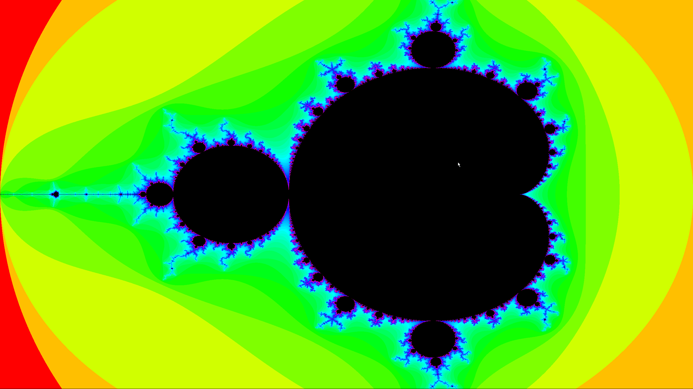

## This is what the output looks like

at default zoom

zoomed in a little

- multithreaded
- zooming via mousewheel
- uses a logarithmic scale to increase contrast and detail

## TODO:
- experiment with different scales and add a way to switch scales
